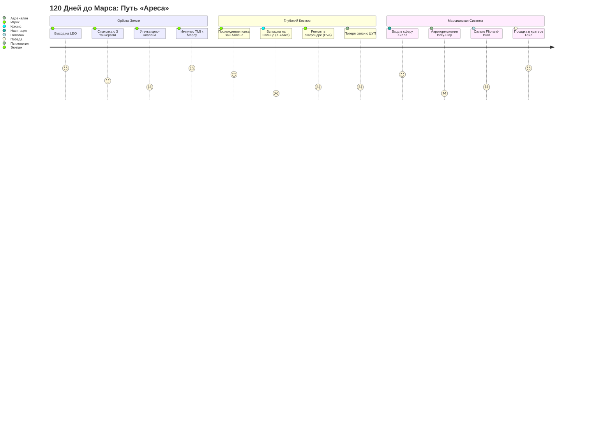

# ДИЗАЙН-ДОКУМЕНТ (GDD): «ПРОЕКТ АРЕС: МАРСИАНСКИЙ ТРАНЗИТ»

> **Жанр:** Научно-фантастический хардкорный симулятор с элементами менеджмента и сюжетного триллера.  
> **Платформы:** iOS (iPhone / iPad), Mac, Web (PWA / ПК).  
> **Локализация:** Двуязычный интерфейс и субтитры с первого дня (**Русский + Английский** / RU & EN).  
> **Срок разработки:** 2 месяца (8 недель).  
> **Сеттинг:** Реалистичный 2038 год. Первая пилотируемая экспедиция на Марс на многоразовом межпланетном корабле нового поколения.

---

## 1. Концепция и визуальный стиль

### 1.1. Главная идея
Игрок выступает в роли капитана корабля и одновременно оператора ЦУП. Игра совмещает:
1. **Макро-уровень (Орбитальный менеджмент и сюжет):** распределение энергии, криогенного топлива, кислорода, решение кризисов с задержкой радиосвязи до 18 минут.
2. **Микро-уровень (Интерактивный пилотаж):**
   * Стыковка с танкером и криогенная дозаправка на орбите Земли.
   * Удержание курса при трансмарсианском импульсе (TMI).
   * Атмосферное торможение «брюхом» (Belly Flop) и посадочный кувырок над Марсом (Flip-and-Burn).

### 1.2. Визуальный и звуковой стиль
* **Визуальный стиль:** «NASA-punk / SpaceX-core». Высокотехнологичная нержавеющая сталь, черные гексагональные термоплитки, неоновые проекционные дисплеи (HUD), холодное звездное небо и реалистичное освещение от Солнца.
* **Звук:**
  * Ультранизкочастотный механический гул метановых двигателей Raptor.
  * Щелчки клапанов наддува гелия, шипение стравливаемого пара жидкого кислорода.
  * Реалистичная тишина в открытом космосе (звуки передаются только через вибрацию корпуса).
  * Напряженный саундтрек в стиле Ханса Циммера («Интерстеллар») и Колина Стетсона.

---

## 2. Симбиоз идей: Илон Маск (SpaceX) + Российская школа (Роскосмос / ИКИ РАН)

Корабль в игре — это синтез лучших инженерных школ планеты:

| Элемент | Вклад SpaceX (Илон Маск) | Вклад Роскосмоса / СССР | Синергия в игре |
| :--- | :--- | :--- | :--- |
| **Корпус и двигатели** | 50-метровый корабль из нержавеющей стали, закрылки-аэрофлапы, метан/кислород (Raptor). | Опыт стыковки модулей тяжелого класса («Мир», «Заря»), двигатели закрытого цикла. | Сверхтяжелый многоразовый планер с непревзойденной прочностью. |
| **Дозаправка на орбите** | Автоматическая стыковка «корма-к-корме», перекачка сотен тонн криогенного топлива в невесомости. | Система взаимных измерений «Курс», пассивно-активный стыковочный узел АПАС. | Напряженная мини-игра стыковки и балансировки кипения метана. |
| **Жизнеобеспечение (LSS)** | Минималистичный комфортный интерьер, спортивные тренажеры, сенсорные экраны. | Замкнутый биологический цикл «БИОС-3», поглотители $CO_2$, регенерация воды из конденсата (СВО). | Выживание экипажа базируется на советском опыте изоляции: поломки гидропоники, фильтры Сабатье. |
| **Энергия и Радиация** | Развертываемые гибкие солнечные массивы, Starlink-лазерная связь. | Ядерный буксир (наработки проекта «Зевс» / ТЭМ) в качестве аварийного реактора; баки с водой как радиационный щит. | Солнечные панели — основное питание, ядерный мини-реактор — аварийный резерв; экипаж прячется в водном бункере. |

---

## 3. Физика, расчеты и баллистика

### 3.1. Уравнение Мещерского — Циолковского
$$\Delta v = I_{sp} \cdot g_0 \cdot \ln\left(\frac{m_0}{m_f}\right)$$
* Для метанового двигателя Raptor: $I_{sp} = 380\text{ с}$ (в вакууме), $g_0 = 9.81\text{ м/с}^2$.
* Сухая масса корабля с грузом ($m_f$): **120 тонн**.
* Масса топлива после орбитальной дозаправки: **1200 тонн** ($m_0 = 1320\text{ т}$).
* Максимальный располагаемый импульс:
  $$\Delta v = 380 \cdot 9.81 \cdot \ln\left(\frac{1320}{120}\right) \approx 3728 \cdot 2.398 \approx 8940\text{ м/с}$$
  *Этот запас позволяет отказаться от медленного Гомана (8.5 месяцев) и лететь по быстрой траектории Маска (110–130 дней).*

### 3.2. Бюджет характеристической скорости ($\Delta v$) миссии:
1. Выход с низкой околоземной орбиты к Марсу (TMI): **$3800\text{ м/с}$**.
2. Коррекции траектории в пути (3 маневра TCM): **$150\text{ м/с}$**.
3. Вход в атмосферу Марса: **$0\text{ м/с}$** (гасится атмосферой через Belly Flop со скорости $7.5\text{ км/с}$ до $250\text{ м/с}$).
4. Посадочный кувырок и реактивное торможение (Flip & Burn): **$800\text{ м/с}$**.
5. Неприкосновенный резерв: **$250\text{ м/с}$**.

### 3.3. Физика орбитальной дозаправки (Orbital Cryo-Refueling)
* **Проблема невесомости:** в невесомости топливо плавает каплями по баку. Насосы захватят пузыри газа и взорвутся.
* **Решение:** Корабль дает микро-тягу вспомогательными двигателями ориентации (RCS), создавая слабую перегрузку ($0.01g$), осаждая жидкий метан на дно бака (Ullage burn).
* **Проблема кипения (Boil-off):** Жидкий метан ($-162^\circ\text{C}$) и кислород ($-183^\circ\text{C}$) нагреваются от солнечных лучей. Каждый час стоянки на орбите теряется 0.1% массы, если не ориентировать корабль зеркальным носом к Солнцу.

### 3.4. Радиозадержка сигнала
$$t_{\text{delay}} = \frac{d(t)}{c}$$
* На орбите Земли: $t_{\text{delay}} \approx 0.001\text{ с}$.
* На середине пути ($1\text{ AU}$): $t_{\text{delay}} \approx 8.3\text{ мин}$.
* У Марса: $t_{\text{delay}} \approx 14–21\text{ мин}$.
* *Игровой эффект:* все приказы с Земли приходят с опозданием, игрок обязан действовать автономно.

---

## 4. Сюжетная линия: Полный сценарий экспедиции



### АКТ 1. На орбитальной заправке (Дни 0 — 12)
* **Завязка:** Корабль «Арес» выведен на орбиту $300\text{ км}$. Баки почти сухие. Стартовое окно откроется через 10 дней — если не заправиться вовремя, Марс уйдет, а экспедицию отменят.
* **Геймплей:** Ручная стыковка с танкерами через интерфейс «Курс». Игрок выравнивает крест на мишени, гасит угловые скорости.
* **Сюжетный поворот 1 (Кризис заправки):** Во время перекачки 3-го танкера заклинивает возвратный клапан дренажа метана. В баке растет критическое давление.
  * *Выбор:* Сбросить 40 тонн метана в космос (потеря запаса маневра) или рискнуть провести продувку гелием высокого давления (риск повреждения топливной магистрали).
* **Финал Акта 1:** Включение всех двигателей Raptor. Ослепительный 6-минутный импульс TMI. Земля стремительно удаляется.

### АКТ 2. Межпланетная бездна (Дни 13 — 95)
* **День 28 — «Солнечный удар»:**
  * Спутник орбитальной солнечной обсерватории фиксирует колоссальный корональный выброс массы. Ударная волна протонов достигнет корабля через 45 минут.
  * *Действия:* Перевод корабля в режим «Щит» (поворот кормой к Солнцу). Перекачка воды в контур вокруг жилого отсека. Экипаж изолируется в 6-метровом бункере.
* **День 62 — «Призрак на радаре» (Психологический кризис):**
  * Потеря прямой радиосвязи с Землей из-за затенения Луной и шумов. На борту обостряются конфликты между американским командиром и российским бортинженером по поводу расхода пайков гидропоники.
* **День 80 — «Свист в темноте»:**
  * Микрометеороид пробивает защитный кожух энергомодуля. Отказывает система обогрева криогенных баков с посадочным топливом. Метан рискует замерзнуть в твердый осадок.
  * *Мини-игра:* Выход в открытый космос (EVA). Игрок управляет космонавтом на фале, используя реактивный ранец, чтобы заменить предохранительный блок снаружи корпуса на фоне бездонного космоса.

* **День 88 — «Хирургия вслепую» (Кризис судового врача):**
  * *Ирония судьбы:* Острый аппендицит с риском перитонита настигает **единственного профессионального врача экспедиции**. Врач в полубессознательном состоянии от лихорадки.
  * *Драматический нерв:* Оперировать вынужден бортинженер или геолог, никогда не державший скальпель. Задержка сигнала с Землей — **14 минут в одну сторону**.
  * *Геймплей:* Земные хирурги из института Склифосовского / Хьюстона шлют пакеты теле-инструкций. Вы должны пошагово руководить операцией в условиях микрогравитации: дезинфекция поля, фиксация органов при отсутствии земной тяжести, антибиотики, шов. Любая ошибка в дозировке или неверный надрез грозит сепсисом.

---

## 4.1. Система экипажа: Канон и Конструктор

В игре предусмотрено 2 режима формирования команды:

### А. Канонический экипаж (По умолчанию — кинематографичный сюжет)
1. **Капитан (Командир миссии):** Ветеран орбитальных полетов. Высокая стрессоустойчивость, бонус к координации при авариях.
2. **Главный пилот:** Бывший летчик-испытатель. Максимальный навык ручного пилотажа при стыковке и посадке.
3. **Бортинженер-механик:** Эксперт по двигателям Raptor и замкнутым системам. Способен собрать переходник из любого мусора.
4. **Судовой врач / Биолог:** Отвечает за здоровье экипажа и марсианскую оранжерею (именно он становится пациентом на 88-й день).

### Б. Кастомный конструктор (Custom Crew Builder — для реиграбельности)
Игрок может создать собственный экипаж, распределяя очки характеристик и черты характера:
* **Ключевые характеристики:** Инженерия, Пилотирование, Медицина, Психическая стойкость.
* **Положительные черты (Perks):** «Железные нервы» (не паникует при пожаре), «Золотые руки» (тратит на 20% меньше запчастей), «Адаптация к невесомости» (нет космической болезни).
* **Отрицательные черты (Flaws):** «Клаустрофобия» (быстрее растет стресс), «Ипохондрик», «Конфликтный характер» (ссорит команду при задержке связи).

### АКТ 3. Красный ад (Дни 96 — 120)
* **День 108 — «Траекторная ошибка»:**
  * Навигационная система вычисляет точку входа: из-за накопившейся погрешности угол входа в марсианскую атмосферу составляет $9.2^\circ$ вместо расчетных $6.5^\circ$. При таком угле корабль либо сгорит, либо испытает перегрузку в $18g$, которая убьет экипаж.
  * *Решение:* Сжечь последний аварийный запас топлива для коррекции перицентра.
* **День 119 — Вход «Belly Flop»:**
  * Скорость входа $7400\text{ м/с}$. Корабль ложится плашмя на марсианский воздух. Температура плиток достигает $1600^\circ\text{C}$.
  * *Геймплей:* Игрок гироскопами удерживает крен и тангаж корабля пальцем, отрабатывая воздушные возмущения. Экран дрожит, радиосвязь блокируется плазменным коконом (Blackout).
* **День 120 — ФИНАЛ: «Flip and Burn»:**
  * Высота $800\text{ метров}$, скорость $280\text{ км/ч}$.
  * Автоматика дает команду на сальто. Корабль за 1.8 секунды встает вертикально. Три центральных Раптора ревут на полную мощность.
  * **Кульминационный пилотаж:** игрок управляет вектором тяги, борется с боковым марсианским ветром и пылевой бурей, выпуская посадочные опоры.
  * Касание грунта. Двигатели выключаются. Тишина.
  * *Финальный кадр:* Трап опускается, первый человек делает шаг на ржавый грунт кратера Гейл на фоне заката с голубым марсианским Солнцем.

---

## 5. Инструменты разработки (Development Stack)

> Раздел вынесен отдельно по требованию. Все инструменты подобраны под связку: **ПК (Windows 10, i7-7700K, GTX 1080) + Mac (Xcode / сборка под iOS)**.

### 5.1. Игровой движок (Game Engine)
* **Выбор: Godot Engine 4.3 (или Unity 6)**
  * *Почему Godot 4:*
    1. Идеален для соло-разработки за 2 месяца: запускается за 1 секунду, не перегружен мусором.
    2. Новый рендерер Vulkan Mobile выдает фотореалистичную картинку на видеокарте GTX 1080 и летает с 60–120 FPS на чипах Apple Silicon (iPhone / iPad).
    3. Язык **GDScript** похож на Python — разработка механик идет в 3 раза быстрее, чем на C++.
    4. Экспорт проекта под iOS генерирует чистый проект Xcode в один клик.

### 5.2. 3D-моделирование и визуальные ассеты
* **Blender 4.x (Бесплатно, открытый исходный код):**
  * Создание низкополигональных (Low/Mid-poly) оптимизированных моделей корабля Starship, солнечных панелей, стыковочных узлов и марсианского посадочного модуля.
  * Запекание карт нормалей (Normal Maps) для отображения отдельных термоплиток и заклепок без нагрузки на процессор телефона.
* **NASA 3D Resources & USGS Astrogeology (Бесплатно):**
  * Официальные карты высот Марса (MOLA / HiRISE) для кратера Гейл и Долины Маринер.
  * 3D-модели оборудования марсианских станций от Лаборатории реактивного движения (JPL NASA).

### 5.3. Текстурирование и 2D-интерфейс (UI)
* **Adobe Photoshop / Figma / Krita:**
  * Создание научно-фантастического интерфейса терминала ЦУП (индикаторы давления, тумблеры, авиагоризонт, экраны телеметрии).
  * Подготовка векторных иконок систем жизнеобеспечения.
* **Substance 3D Painter (или ArmorPaint):**
  * Текстурирование нержавеющей стали с царапинами, копотью от ракетных двигателей и следами марсианской пыли.

### 5.4. Звук и музыка
* **Reaper / Audacity (DAW):**
  * Сведение звуков: радиопомехи, механический рокот двигателей, дыхание астронавта в шлемофоне, сигналы аварийных сирен.
* **NASA Audio Collection (Архив в открытом доступе):**
  * Реальные оцифрованные записи радиопереговоров миссий «Аполлон», «Спейс Шаттл» и марсохода «Кьюриосити».

### 5.5. Станция сборки и релизная среда (Mac & iOS)
* **Apple Xcode 16+ (на вашем компьютере Mac):**
  * Компиляция проекта под iOS, симуляция на виртуальных iPhone всех размеров.
  * Прямая установка по проводу на ваш iPhone через бесплатный личный сертификат Apple ID.
* **Git + GitHub / GitLab:**
  * Контроль версий: пишем код на ПК (Windows), пушим в репозиторий, забираем на Mac и собираем билд.

---

### 5.6. Архитектура локализации (i18n / Локализация RU + EN)
* **Таблица ключей переводов (CSV / GetText PO):** Все тексты, телеметрия, радиопереговоры и названия тумблеров хранятся в единой таблице (`localization.csv`).
* **Мгновенное переключение:** Переключатель языка (`RU | EN`) прямо в правом верхнем углу интерфейса или автоопределение по языку операционной системы iPhone / Mac.
* **Глобальный охват:** С первого дня игра готова к мировому релизу в App Store (США, Европа, Азия) и на локальных рынках (RuStore, VK Play, Яндекс Игры).

---

## 6. Производственный календарь на 8 недель (План запуска за 2 месяца)

```
[Неделя 1] Архитектура проекта и базовая орбитальная физика в Godot.
[Неделя 2] Механика орбитальной стыковки и перекачки крио-топлива (Ullage burn).
[Неделя 3] Система ресурсов корабля (Метан, Кислород, Энергия, Нагрев).
[Неделя 4] Сюжетный движок: тексты кризисов, диалоги с экипажем и ЦУП.
[Неделя 5] 3D-модель Starship, текстуры плиток, пламя двигателей и частицы.
[Неделя 6] Механика атмосферного входа Belly-Flop и посадочный Flip-and-Burn.
[Неделя 7] Перенос проекта на Mac, сборка в Xcode, первый запуск на iPhone.
[Неделя 8] Балансировка сложности, полировка звука, финальная сборка.
```

---

## 7. Монетизация и распространение

1. **Формат распространения:** Premium-игра (например, $2.99 / 249 руб.) без навязчивой рекламы и микротранзакций — игроки в жанре Sci-Fi ценят чистоту погружения.
2. **Платформы запуска:**
   * **App Store (iOS / iPadOS / macOS).**
   * **VK Play / RuStore / Яндекс Игры (Web-версия).**
   * **Steam (ПК-версия создается нажатием одной кнопки экспорта в Godot).**
